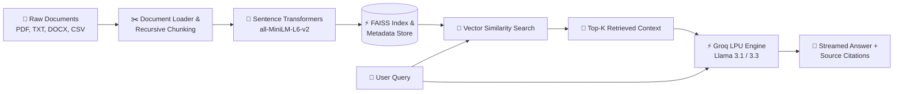

# ⚡ DocuMind AI — Modular Document RAG Engine

[](https://www.python.org/)
[](https://python.langchain.com/)
[](https://github.com/facebookresearch/faiss)
[](https://console.groq.com/)
[](https://streamlit.io/)

**DocuMind AI** is an end-to-end, high-performance Retrieval-Augmented Generation (RAG) system. It indexes multi-format documents (PDF, TXT, DOCX, CSV), generates dense semantic vector embeddings with Sentence-Transformers, performs sub-millisecond similarity search using FAISS, and streams contextual answers via Groq's high-speed LLM inference.

---

## ✨ Features

- **🚀 Real-Time Token Streaming**: Experience instantaneous token-by-token generation powered by Groq's LPU.
- **💬 Conversational UI**: Interactive ChatGPT-style chat interface with full conversation history and starter prompts.
- **📁 Live Document Ingestion**: Upload custom PDFs, TXTs, DOCXs, or CSVs directly through the UI and dynamically re-index the corpus.
- **🔍 Source Citations & Transparency**: Inspect exact retrieved chunk snippets, document names, page numbers, and similarity distances.
- **⚙️ Model & Hyperparameter Switching**: Seamlessly toggle between models (`openai/gpt-oss-120b`, `openai/gpt-oss-20b`, `qwen/qwen3.8-27b`, `groq/compound-mini`), adjust top-k retrieval chunks, and tweak response temperature.
- **🧩 Clean Modular Architecture**: Fully decoupled ingestion, embedding, vector store, and search modules.

---

## 🏗️ Architecture Flow



---

## 🚀 Quick Start

### 1. Clone the Repository
```bash
git clone https://github.com/<your-username>/documind-rag.git
cd documind-rag
```

### 2. Set Up Virtual Environment
```bash
# Windows
python -m venv .venv
.venv\Scripts\activate

# macOS / Linux
python3 -m venv .venv
source .venv/bin/activate
```

### 3. Install Dependencies
```bash
pip install -r requirements.txt
```

### 4. Configure Environment Variables
Create a `.env` file from the template:
```bash
cp .env.example .env
```
Add your free [Groq API Key](https://console.groq.com/keys) inside `.env`:
```env
GROQ_API_KEY=gsk_your_groq_api_key_here
```

### 5. Launch the Web Application
```bash
streamlit run src/app.py
```
*The app will automatically launch in your browser at `http://localhost:8501`.*

---

## 📂 Project Structure

```text
documind-rag/
├── data/                  # Document corpus (PDFs, text files, uploads)
│   ├── text_files/        # Default starter text files
│   └── uploads/           # User-uploaded files via UI
├── faiss_store/           # Local FAISS index & metadata (generated at runtime)
├── src/
│   ├── app.py             # Streamlit conversational web interface
│   ├── data_loader.py     # Multi-format document ingestion (PDF, TXT, CSV, DOCX)
│   ├── embedding.py       # Text chunking & dense vector embedding pipeline
│   ├── vectorstore.py     # FAISS vector store indexing, persistence & search
│   └── search.py          # RAG pipeline orchestration, streaming & Groq LLM
├── .env.example           # Example environment template
├── .gitignore             # Git ignore rules for keys and vector indices
├── README.md              # Documentation
└── requirements.txt       # Project dependencies
```

---

## 🌐 Deploying to Streamlit Cloud

1. Push your repository to GitHub.
2. Visit [Streamlit Community Cloud](https://share.streamlit.io/) and create a **New App**.
3. Select your repository and set the main file path to:
   ```text
   src/app.py
   ```
4. In **Advanced Settings -> Secrets**, add:
   ```toml
   GROQ_API_KEY = "gsk_your_groq_api_key_here"
   ```
5. Click **Deploy**!

---

## 🛠️ Tech Stack

- **Orchestration**: LangChain Core / Community
- **Embeddings**: `sentence-transformers` (`all-MiniLM-L6-v2`)
- **Vector Database**: FAISS (Facebook AI Similarity Search)
- **LLM Serving**: Groq Cloud (`llama-3.1-8b-instant`, `llama-3.3-70b-versatile`)
- **Frontend**: Streamlit
